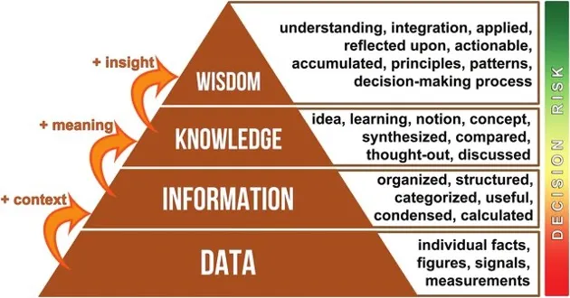

# PENGANTAR SIM DAN KONVERGENSI DENGAN KOMUNIKASI ORGANISASI

---

### A. DESKRIPSI MATA KULIAH

Mata kuliah ini membangun pemahaman fundamental tentang Sistem Informasi Manajemen (SIM) sebagai tulang punggung organisasi modern. Pembahasan dimulai dari konsep paling dasar tentang **sistem** dan **informasi**, termasuk hierarki **Data, Informasi, Pengetahuan, dan Kebijaksanaan (DIKW)** . Selanjutnya, materi mengupas tuntas definisi, komponen, tujuan, dan jenis-jenis SIM. Sebagai puncak, materi menjembatani SIM dengan dinamika **Komunikasi Organisasi** untuk menunjukkan bagaimana konvergensi keduanya menciptakan efisiensi, transparansi, dan efektivitas dalam pengelolaan lembaga, khususnya lembaga dakwah dan penyiaran Islam. Mahasiswa KPI diposisikan sebagai aktor kunci yang menjadi **jembatan integratif** antara data dan komunikasi.

---

### B. CAPAIAN PEMBELAJARAN

Setelah mempelajari materi ini, mahasiswa diharapkan mampu:

1.  Menjelaskan konsep dasar **sistem** dan karakteristiknya.
2.  Menjelaskan definisi **data** dan **informasi**, serta membedakan keduanya secara tajam.
3.  Memahami hierarki **DIKW (Data-Information-Knowledge-Wisdom)** dan proses transformasi di dalamnya.
4.  Menjelaskan definisi, komponen, dan tujuan utama **Sistem Informasi Manajemen (SIM)** .
5.  Mengidentifikasi berbagai jenis SIM (TPS, MIS, DSS) dan fungsinya dalam organisasi.
6.  Menjelaskan konsep dasar **Komunikasi Organisasi** sebagai konteks operasional SIM.
7.  Menganalisis titik **konvergensi** antara SIM dan Komunikasi Organisasi.
8.  Merumuskan **peran strategis lulusan Komunikasi dan Penyiaran Islam (KPI)** dalam era konvergensi digital di lembaga dakwah.

---

### C. RINGKASAN ALUR MATERI (REVIEW CEPAT)

| TAHAP              | INTI POKOK                                                                                                                                                |
| :----------------- | :-------------------------------------------------------------------------------------------------------------------------------------------------------- |
| **1. SISTEM**      | Komponen saling terkait: **Input** → **Proses** → **Output** → **Feedback**.                                                                              |
| **2. DIKW**        | **Data** (Fakta) → **Informasi** (Makna) → **Pengetahuan** (Pengalaman) → **Kebijaksanaan** (Nilai).                                                      |
| **3. SIM**         | Sistem pengolah data untuk manajemen. **Komponen:** Manusia, Hardware, Software, Jaringan, Data. **Level:** TPS (Harian), MIS (Bulanan), DSS (Strategis). |
| **4. KOMUNIKASI**  | Proses pertukaran pesan dalam organisasi. **Fungsi:** Informatif, Regulatif, Persuasif, dan Integratif.                                                   |
| **5. KONVERGENSI** | **SIM** (Infrastruktur) + **Komunikasi** (Makna) = **Data Komunikatif** & **Komunikasi Berbasis Data**.                                                   |
| **6. PERAN KPI**   | **Jembatan Integratif:** Penerjemah data, pengelola saluran, penjaga etika Islam, dan analis kebutuhan umat.                                              |

### D. URAIAN MATERI POKOK

#### 1. FONDASI AWAL: MEMAHAMI "SISTEM"

Sebelum berbicara tentang Sistem Informasi, kita harus paham terlebih dahulu apa itu "sistem" secara fundamental.

**1.1. Definisi Sistem**

**Sistem** adalah sekumpulan komponen atau elemen yang saling berhubungan dan berinteraksi untuk mencapai suatu tujuan atau sasaran tertentu. Kata kuncinya adalah: **komponen, hubungan, dan tujuan**.

**1.2. Karakteristik atau Elemen Umum Sistem**

Sebuah sistem, sesederhana apapun, umumnya memiliki elemen-elemen berikut:

1.  **Komponen (Components):** Bagian-bagian yang membentuk sistem. Bisa berupa fisik (manusia, mesin) atau abstrak (prosedur, aturan).
2.  **Batasan (Boundary):** Pemisah antara sistem dengan lingkungan luarnya. Apa yang termasuk dalam sistem dan apa yang di luar sistem.
3.  **Lingkungan Luar (Environment):** Segala sesuatu di luar batas sistem yang dapat mempengaruhi sistem.
4.  **Penghubung (Interface):** Media yang menghubungkan antar komponen dalam sistem, atau menghubungkan sistem dengan lingkungan luarnya.
5.  **Masukan (Input):** Sesuatu yang masuk ke dalam sistem untuk diolah. Bisa berupa bahan baku, energi, atau data.
6.  **Proses (Process):** Bagian yang mengolah masukan menjadi keluaran.
7.  **Keluaran (Output):** Hasil dari proses yang dikeluarkan oleh sistem.
8.  **Umpan Balik (Feedback):** Informasi tentang kinerja sistem yang digunakan untuk mengendalikan dan memperbaiki sistem.

**Contoh Sistem Sederhana: Sistem Pemanas Ruangan**

- **Komponen:** Termostat, pemanas, pipa, ruangan.
- **Input:** Suhu ruangan saat ini, suhu yang diinginkan (setting).
- **Proses:** Termostat membandingkan suhu saat ini dengan suhu yang diinginkan. Jika lebih dingin, ia mengaktifkan pemanas.
- **Output:** Udara hangat.
- **Feedback:** Suhu ruangan yang naik akan dideteksi kembali oleh termostat, dan pemanas akan mati jika sudah mencapai suhu yang diinginkan.

**Contoh Sistem dalam Organisasi: Sistem Penggajian Karyawan**

- **Komponen:** Data karyawan, data absensi, aturan perhitungan gaji, aplikasi penggajian, bendahara.
- **Input:** Data jam kerja, data lembur, data potongan.
- **Proses:** Menghitung gaji berdasarkan aturan yang berlaku.
- **Output:** Slip gaji, transfer gaji ke rekening karyawan.
- **Feedback:** Laporan total biaya gaji untuk manajemen.

---

#### 2. FONDASI KEDUA: MEMAHAMI "DATA, INFORMASI, PENGETAHUAN, DAN KEBIJAKSANAAN"

Setelah memahami sistem, kita perlu memahami bahan bakunya, yaitu data, dan bagaimana ia bertransformasi menjadi sesuatu yang lebih bernilai.

**2.1. Definisi Data**

**Data** adalah fakta mentah, angka, simbol, atau catatan yang belum diproses dan belum memiliki makna. Data bersifat objektif dan belum diinterpretasi. Data adalah bahan mentah yang belum berguna bagi pengambilan keputusan.

- **Contoh Data:** "35", "Jakarta", "Rp1.000.000", "07.00", "Laki-laki".

**2.2. Definisi Informasi**

**Informasi** adalah data yang telah diolah, diproses, dan diberi konteks sehingga memiliki makna dan berguna untuk pengambilan keputusan. Informasi bersifat subjektif karena bergantung pada konteks dan penerimanya.

- **Contoh Informasi:** "Suhu ruangan saat ini 35 derajat Celcius, lebih panas dari batas normal 25 derajat. Nyalakan AC." "Jumlah donasi hari ini Rp1.000.000, mencapai target harian."

**2.3. Hierarki DIKW (Data-Information-Knowledge-Wisdom)**

Hubungan antara data, informasi, dan level yang lebih tinggi sering digambarkan dalam sebuah piramida yang disebut **Piramida DIKW**. Ini adalah fondasi penting dalam ilmu informasi dan manajemen pengetahuan.

**Penjelasan Hierarki dari Bawah ke Atas:**

1.  **DATA (Tingkat Terbawah):**
    - **Bentuk:** Fakta mentah, simbol, angka tanpa konteks.
    - **Contoh:** "50", "A", "Rp. 5.000.000", "17.30", "Jamaah".
    - **Pertanyaan yang Dijawab:** "Apa?" (What?)

2.  **INFORMASI (Tingkat Kedua):**
    - **Proses:** Data diberi konteks, dikategorikan, dihitung, diringkas sehingga memiliki makna.
    - **Contoh:** "Jumlah jamaah shalat Maghrib hari ini 50 orang." "Total donasi minggu ini Rp. 5.000.000."
    - **Pertanyaan yang Dijawab:** "Siapa, apa, kapan, di mana?" (Who, What, When, Where?) - menjawab pertanyaan deskriptif.

3.  **PENGETAHUAN (KNOWLEDGE) (Tingkat Ketiga):**
    - **Proses:** Informasi diaplikasikan, dikombinasikan dengan pengalaman, konteks, interpretasi, dan refleksi. Pengetahuan menjawab pertanyaan "bagaimana" dan mulai menjawab "mengapa".
    - **Contoh:** "Jumlah jamaah Maghrib (50 orang) selalu lebih rendah dari jamaah Isya (80 orang). Ini mungkin karena setelah Maghrib banyak jamaah yang langsung pulang dan tidak menunggu Isya. **Saya tahu** bahwa untuk meningkatkan jamaah Isya, perlu ada kegiatan menarik di antara Maghrib dan Isya, seperti kajian singkat."
    - **Pertanyaan yang Dijawab:** "Bagaimana?" (How?) - menjawab pertanyaan prosedural dan kausalitas sederhana.

4.  **KEBIJAKSANAAN (WISDOM) (Tingkat Puncak):**
    - **Proses:** Pengetahuan yang diinternalisasi, dipahami secara mendalam, dikombinasikan dengan nilai-nilai, etika, dan intuisi, sehingga mampu membuat keputusan dan prediksi jangka panjang yang bijaksana. Kebijaksanaan bersifat visioner dan berorientasi masa depan.
    - **Contoh:** "Fenomena turunnya jamaah setelah Maghrib adalah pola umum di masyarakat urban. Namun, memaksakan kajian di waktu itu bisa jadi tidak efektif karena mereka mungkin lelah setelah bekerja. **Yang paling bijaksana** adalah memulai program 'Maghrib Mengaji' selama 15 menit setelah shalat, agar mereka tetap mendapat siraman rohani tanpa menahan mereka terlalu lama. Untuk jangka panjang, kita perlu mendekati tokoh-tokoh di perumahan ini untuk menghidupkan kembali shalat berjamaah di masjid sebagai kebiasaan, bukan kewajiban."
    - **Pertanyaan yang Dijawab:** "Mengapa?" (Why?) dan "Ke arah mana?" (Where to?) - menjawab pertanyaan filosofis dan strategis.

**Relevansi bagi KPI:**

- Anda akan banyak bekerja dengan **data** (angka donasi, jumlah penonton, data demografi).
- Tugas pertama Anda adalah mengubahnya menjadi **informasi** yang mudah dipahami.
- Tugas yang lebih tinggi adalah membangun **pengetahuan** tentang audiens Anda dari informasi tersebut.
- Puncaknya, Anda diharapkan memiliki **kebijaksanaan** dalam merancang strategi dakwah dan komunikasi yang tidak hanya efektif, tetapi juga etis dan berkelanjutan, berdasarkan pemahaman mendalam tentang data, informasi, dan pengetahuan yang Anda miliki.

---

#### 3. SISTEM INFORMASI MANAJEMEN (SIM)

Setelah memahami **sistem** dan hierarki **data-informasi**, kita sekarang dapat mendefinisikan SIM dengan lebih utuh.

**3.1. Definisi Sistem Informasi Manajemen**

**Sistem Informasi Manajemen (SIM)** adalah serangkaian sistem yang terintegrasi yang mengkombinasikan **komponen-komponen sistem** (manusia, hardware, software, jaringan, prosedur) untuk mengumpulkan, menyimpan, memproses, dan mendistribusikan **data** sehingga menjadi **informasi** yang berguna, guna mendukung proses manajemen, pengambilan keputusan, koordinasi, dan pengendalian dalam sebuah organisasi.

SIM bukan sekadar tentang komputer atau perangkat lunak. SIM adalah tentang **bagaimana organisasi secara sistematis mengelola aset informasinya** untuk mencapai tujuan.

**3.2. Komponen Sistem Informasi (Mengulang dengan Penekanan)**

Lima komponen ini harus bekerja sama. Jika satu lemah, seluruh sistem terganggu.

1.  **Manusia (Brainware):** Komponen paling penting. Manusia adalah pengguna, pengelola, pengembang, dan penentu arah sistem. Termasuk di dalamnya: operator data, manajer, staf IT, dan **komunikator (lulusan KPI)** yang menjembatani data dengan audiens.
2.  **Perangkat Keras (Hardware):** Perangkat fisik: komputer, server, smartphone, printer, kabel jaringan.
3.  **Perangkat Lunak (Software):** Program yang menjalankan perintah: sistem operasi, aplikasi pengolah data, aplikasi komunikasi.
4.  **Jaringan (Network):** Infrastruktur penghubung: internet, intranet, WiFi, cloud server.
5.  **Data:** Bahan baku yang menjadi inti dari seluruh proses.

**3.3. Tujuan Utama SIM**

1.  **Mendukung Operasional Harian:** Memastikan roda organisasi berputar lancar (pencatatan transaksi, absensi, penjadwalan).
2.  **Mendukung Pengambilan Keputusan:** Menyediakan informasi yang akurat dan tepat waktu bagi manajemen di semua level.
3.  **Mendukung Keunggulan Strategis:** Memberikan organisasi kemampuan untuk unggul dibanding organisasi lain.

**3.4. Jenis-Jenis Sistem Informasi**

| Jenis Sistem                            | Pengguna Utama     | Fungsi Utama                                           | Contoh di Lembaga Islam                                    |
| :-------------------------------------- | :----------------- | :----------------------------------------------------- | :--------------------------------------------------------- |
| **TPS (Transaction Processing System)** | Staf operasional   | Mencatat transaksi rutin harian.                       | Aplikasi kas masuk/keluar, sistem pendaftaran santri baru. |
| **MIS (Management Information System)** | Manajemen menengah | Menyajikan laporan ringkasan untuk pemantauan kinerja. | Laporan bulanan total donasi per program.                  |
| **DSS (Decision Support System)**       | Manajemen puncak   | Menganalisis data kompleks untuk keputusan strategis.  | Simulasi proyeksi jika membuka cabang baru.                |

---

#### 4. SIM DALAM KONTEKS ORGANISASI

SIM berfungsi sebagai tulang punggung koordinasi, menghubungkan seluruh bagian organisasi.

**Studi Kasus: SIM di Pondok Pesantren**

- **Divisi Penerimaan Santri (TPS):** Mendaftarkan santri baru, menginput data ke database pusat.
- **Divisi Keuangan (MIS):** Mengakses data santri untuk membuat tagihan dan mencatat pembayaran.
- **Divisi Akademik:** Melihat data santri yang lunas untuk mengaktifkan akses ujian dan menyusun jadwal.
- **Divisi Logistik:** Melihat jumlah santri aktif untuk menyiapkan jatah makan.
- **Pimpinan Pondok (DSS):** Membuka dashboard yang menunjukkan data real-time.

Tanpa SIM terintegrasi, data dicatat berulang, sering terjadi selisih data, laporan lambat, dan pimpinan kesulitan memantau kinerja.

---

#### 5. MEMAHAMI KOMUNIKASI ORGANISASI

**5.1. Definisi Komunikasi Organisasi**

Komunikasi Organisasi adalah proses penciptaan, pertukaran, penyimpanan, dan interpretasi pesan dalam jaringan hubungan yang saling bergantung untuk mencapai tujuan organisasi.

**5.2. Fungsi Utama Komunikasi Organisasi**

1.  **Informatif:** Menyampaikan informasi yang dibutuhkan anggota.
2.  **Regulatif:** Menyampaikan aturan dan kebijakan.
3.  **Persuasif:** Membujuk untuk mencapai target.
4.  **Integratif:** Membangun kebersamaan dan keharmonisan.

**5.3. Aliran Informasi dalam Organisasi**

- **Vertikal ke Bawah:** Atasan ke bawahan.
- **Vertikal ke Atas:** Bawahan ke atasan.
- **Horizontal:** Antar rekan setingkat.
- **Diagonal:** Lintas level dan divisi.

---

#### 6. KONVERGENSI SIM DAN KOMUNIKASI ORGANISASI

**6.1. Titik Temu SIM dan Komunikasi Organisasi**

| Aspek              | **SISTEM INFORMASI MANAJEMEN**         | **KOMUNIKASI ORGANISASI**                       | **HASIL KONVERGENSI**                                                 |
| :----------------- | :------------------------------------- | :---------------------------------------------- | :-------------------------------------------------------------------- |
| **Tujuan Utama**   | Menyediakan data dan informasi akurat. | Menciptakan pemahaman bersama.                  | Koordinasi efektif dan keputusan tepat yang dipahami semua pihak.     |
| **Fokus**          | **Apa** datanya? (akurasi, kecepatan)  | **Bagaimana** pesan disampaikan? (gaya, empati) | Penyampaian data yang komunikatif dan persuasif.                      |
| **Perangkat**      | Hardware, software, database.          | Rapat, email, WhatsApp, media sosial.           | Platform komunikasi terintegrasi yang menggabungkan data dan diskusi. |
| **Pengguna Kunci** | Staf IT, analis data.                  | Semua anggota, terutama humas.                  | **Komunikator yang melek data (lulusan KPI)** sebagai jembatan.       |

**6.2. Peran Strategis Lulusan KPI: Jembatan Integratif**

Lulusan KPI berperan sebagai **Jembatan Integratif** antara dunia data (SIM) dan dunia manusia (Komunikasi). Peran tersebut meliputi:

1.  **Penerjemah Data (Data Translator):** Menerjemahkan laporan angka dan data teknis ke dalam bahasa yang mudah dipahami publik.
2.  **Pengelola Saluran Komunikasi (Channel Manager):** Memilih dan mengelola platform yang tepat untuk menyebarkan informasi dari SIM.
3.  **Penjaga Etika dan Nilai (Ethical Guardian):** Memastikan penggunaan data sesuai nilai Islam dan etika komunikasi.
4.  **Analis Kebutuhan Pengguna (User Needs Analyst):** Menyuarakan kebutuhan pengguna dalam pengembangan sistem informasi.

**6.3. Tantangan dan Peluang**

| **TANTANGAN**                               | **PELUANG (PERAN ANDA)**                                     |
| :------------------------------------------ | :----------------------------------------------------------- |
| Kesenjangan literasi digital.               | Menjadi jembatan komunikasi antara tim IT dan tim dakwah.    |
| Information Overload.                       | Menjadi kurator dan penyaring informasi.                     |
| Risiko dehumanisasi karena fokus pada data. | Menjaga sentuhan manusiawi dan nilai Islam dalam komunikasi. |
| Krisis kepercayaan akibat kebocoran data.   | Menjadi manajer krisis komunikasi.                           |
| Tuntutan adaptif dengan teknologi baru.     | Menjadi agen pembelajaran bagi rekan kerja.                  |

---

### D. RANGKUMAN

1.  **Sistem** adalah kumpulan komponen yang saling berhubungan untuk mencapai tujuan.
2.  **Data** adalah fakta mentah. **Informasi** adalah data yang telah diberi makna. **Pengetahuan** adalah informasi yang diaplikasikan dengan pengalaman. **Kebijaksanaan** adalah pengetahuan yang diinternalisasi dengan nilai untuk membuat keputusan visioner.
3.  **Sistem Informasi Manajemen (SIM)** adalah sistem terintegrasi yang mengolah data menjadi informasi untuk mendukung operasional, pengambilan keputusan, dan keunggulan strategis organisasi, melalui 5 komponen (manusia, hardware, software, jaringan, data) dan berbagai jenis sistem (TPS, MIS, DSS).
4.  **Komunikasi Organisasi** adalah proses memberi makna dan mengalirkan pesan dalam organisasi.
5.  **Konvergensi SIM dan Komunikasi Organisasi** terjadi ketika infrastruktur data berpadu dengan pengelola makna, menghasilkan komunikasi yang berbasis data dan data yang dikomunikasikan secara efektif.
6.  **Peran strategis lulusan KPI** adalah menjadi Jembatan Integratif: komunikator yang melek data, memastikan teknologi melayani dakwah.

---

### E. DAFTAR REFERENSI

1.  Laudon, K. C., & Laudon, J. P. (2020). _Management Information Systems: Managing the Digital Firm_ (16th ed.). Pearson.
2.  O'Brien, J. A., & Marakas, G. M. (2011). _Management Information Systems_ (10th ed.). McGraw-Hill/Irwin.
3.  Rowley, J. (2007). The wisdom hierarchy: representations of the DIKW hierarchy. _Journal of Information Science_.
4.  Miller, K. (2015). _Organizational Communication: Approaches and Processes_ (7th ed.). Cengage Learning.
5.  Pace, R. W., & Faules, D. F. (2018). _Komunikasi Organisasi_. Remaja Rosdakarya.
6.  Jenkins, H. (2006). _Convergence Culture_. New York University Press.

---

### F. TUGAS MANDIRI

**Judul Tugas:** "Mengamati SIM Sederhana di Sekitar Kita"

**Instruksi:**

1.  Pilih satu organisasi/komunitas kecil di sekitar Anda (masjid, TPQ, majelis taklim, atau keluarga).
2.  Amati dan catat:
    - Data apa saja yang mereka catat?
    - Bagaimana mereka mencatatnya? (buku, Excel, aplikasi, ingatan?)
    - Apakah data tersebut diolah menjadi informasi untuk mengambil keputusan? Jika ya, keputusan apa?
    - Apakah ada proses berbagai informasi (komunikasi) dari catatan tersebut kepada pihak lain?
3.  Tuliskan hasil pengamatan Anda dalam 1-2 paragraf.

---

**"Jadilah Komunikator yang Kuat karena Berpijak pada Data, dan Jadilah Pengelola Data yang Bijak karena Dibingkai oleh Nilai."**

**Selamat Belajar!**
